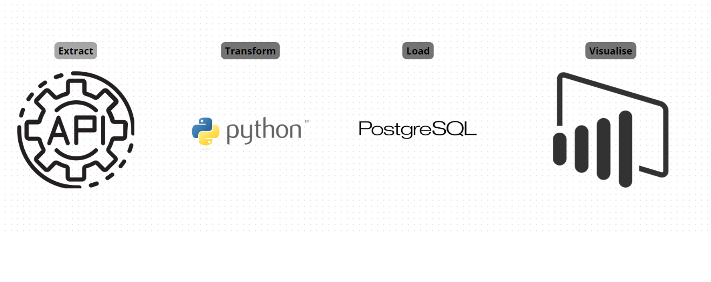
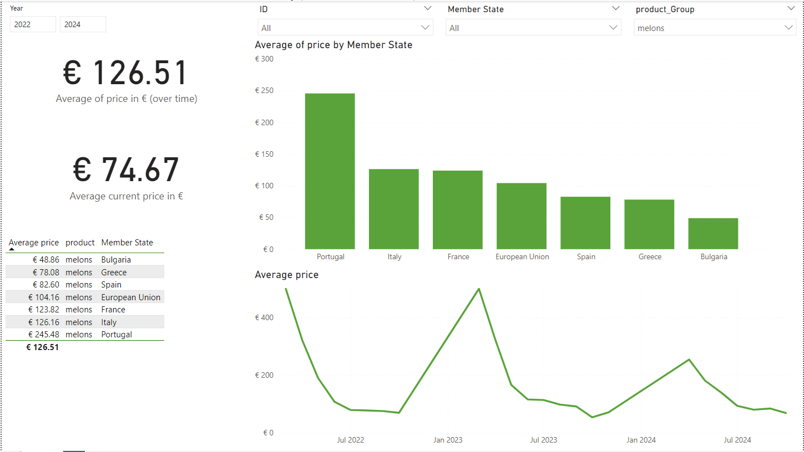

# Fruits_Vegetables
# EU Market Data Importer and Visualizer

## Table of Contents
- [Project Overview](#project-overview)
- [Features](#features)
- [Technologies Used](#technologies-used)
- [Installation](#installation)
- [Data Flow](#data-flow)
- [Visualizing Data](#visualizing-data)

## Project Overview

This project is designed to import market data from the EU Market API, clean and validate the data using Python, export it to a PostgreSQL database, and visualize the results using Power BI. The workflow automates data handling, making it easier to analyze market trends and patterns.

## Features

- **Data Import**: Fetches market data from the EU Market API.
- **Data Cleaning**: Cleans the data by removing duplicates, filling missing values, and standardizing formats.
- **Data Validation**: Validates the data against predefined rules to ensure accuracy and consistency.
- **Database Export**: Exports the cleaned data to a PostgreSQL database for storage and further analysis.
- **Data Visualization**: Allows visualization of the data using Power BI for insightful reporting.

## Technologies Used

- **Python**: Main programming language for data processing and cleaning.
- **pandas**: For data manipulation and cleaning.
- **psycopg2** or **SQLAlchemy**: To connect and interact with PostgreSQL.
- **PostgreSQL**: Database for storing cleaned data.
- **Power BI**: For visualizing the data and creating dashboards.
- **Requests**: For making API calls to fetch data from the EU Market API.

## Data Flow

## Visualizing Data

